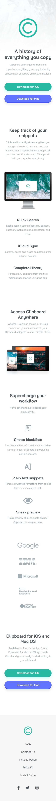
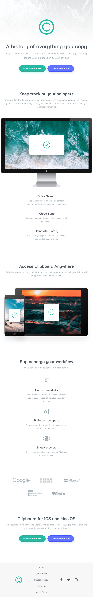
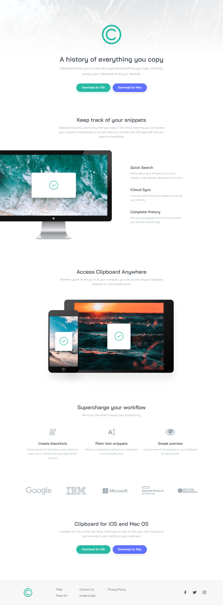

# Frontend Mentor - Clipboard landing page solution

This is a solution to the [Clipboard landing page challenge on Frontend Mentor](https://www.frontendmentor.io/challenges/clipboard-landing-page-5cc9bccd6c4c91111378ecb9). Frontend Mentor challenges help you improve your coding skills by building realistic projects. 

## Table of contents

- [Overview](#overview)
  - [The challenge](#the-challenge)
  - [Screenshot](#screenshot)
  - [Links](#links)
- [My process](#my-process)
  - [Built with](#built-with)
- [Author](#author)

## Overview

### The challenge

Users should be able to:

- View the optimal layout for the site depending on their device's screen size
- See hover states for all interactive elements on the page

### Screenshot

#### Result Mobile

#### Result Tablets

#### Result Desktops

### Links

- Solution URL: [Respository Project](https://github.com/Samuel-Amaro/clipboard-landing-page)
- Live Site URL: [Result Live](https://samuel-amaro.github.io/clipboard-landing-page/)

## My process

### Built with

- Semantic HTML5 markup
- CSS custom properties
- Flexbox
- CSS Grid
- Mobile-first workflow
- Normalize CSS - [Normalize](https://necolas.github.io/normalize.css/) - Reset CSS
- Methodology BEM(Block Element Modifier) - [BEM](http://getbem.com/introduction/) - Methodology
- Icons - [Font Awesome](https://fontawesome.com/)

## Author

- Website - [Samuel-Amaro](https://www.linkedin.com/in/samuel-amaro/)
- Frontend Mentor - [@Samuel-Amaro](https://www.frontendmentor.io/profile/Samuel-Amaro)

